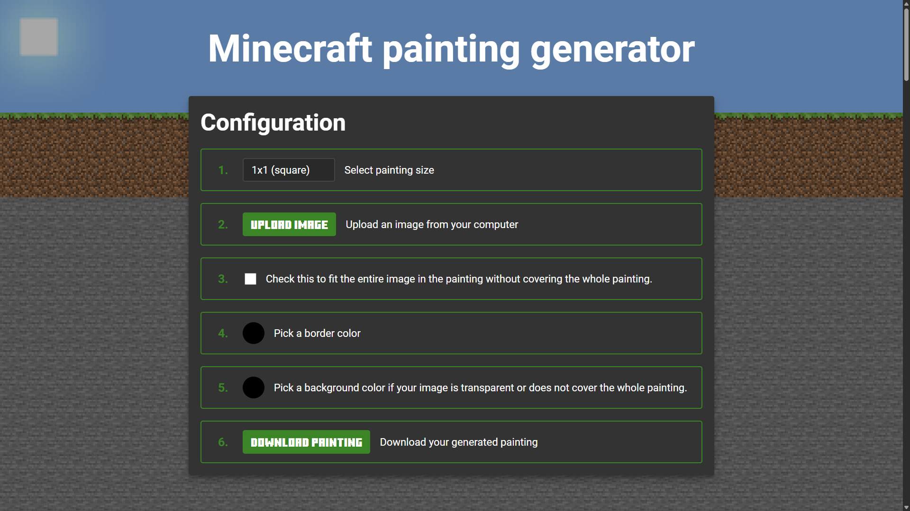
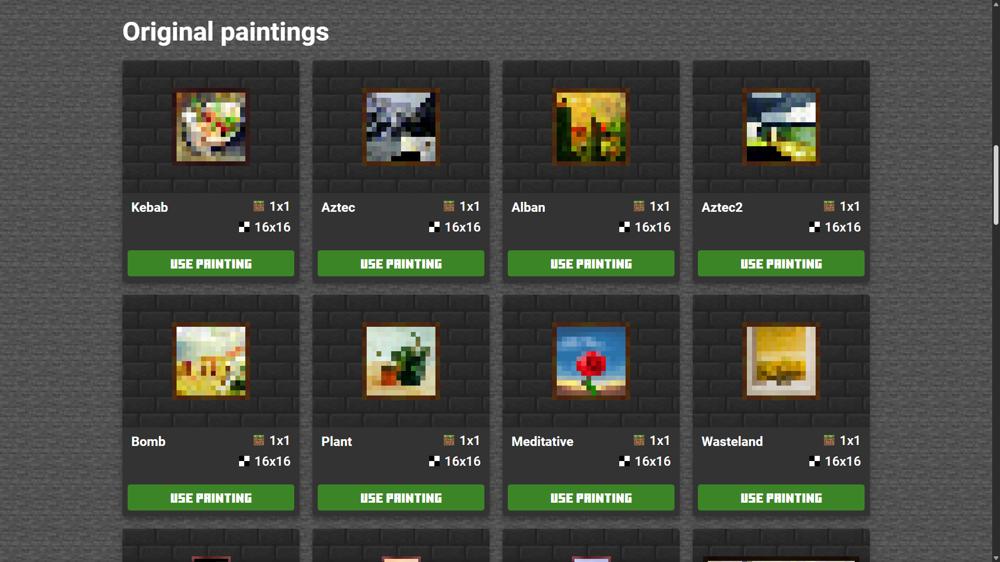
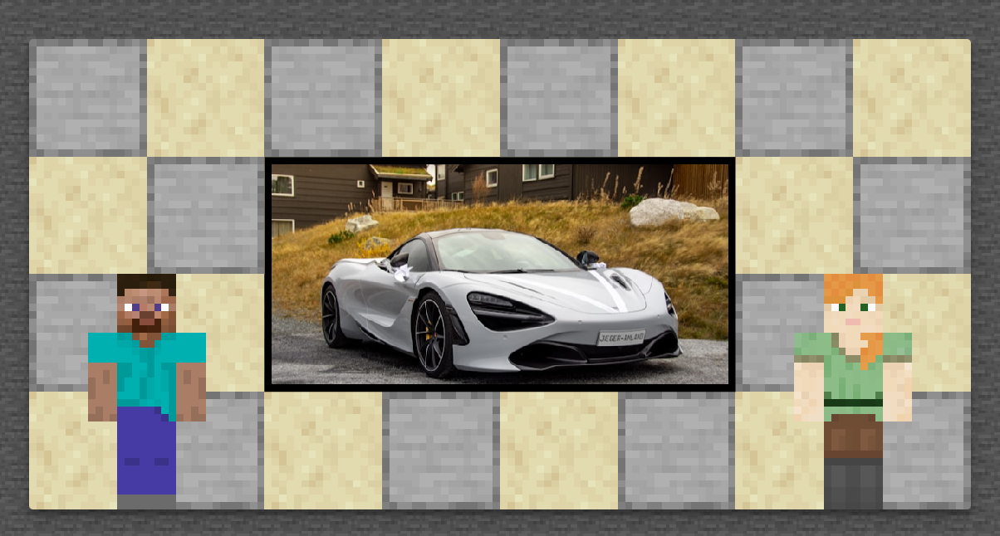
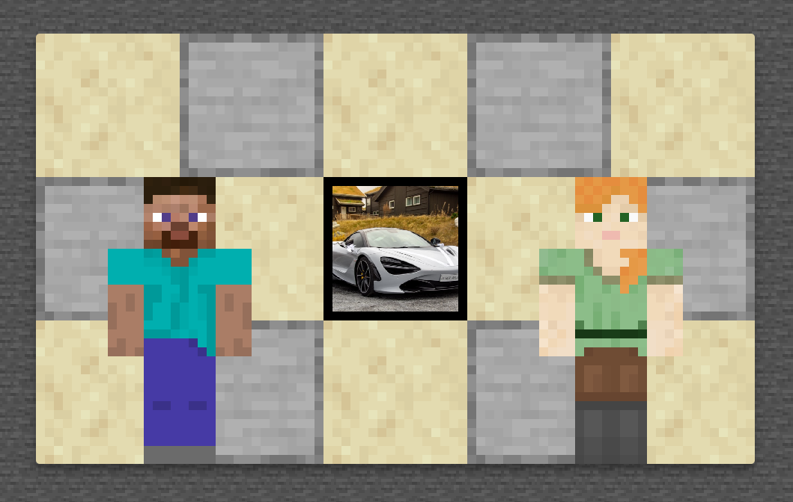

# Minecraft Painting Generator



## What is this project?

The Minecraft Painting Generator is a web-based tool that allows users to create custom Minecraft-style paintings. Users can upload their own images, select from a variety of painting sizes, adjust border and background colors, and download the result as a ready-to-use PNG. The tool also showcases all the original Minecraft paintings for easy reference and inspiration.

## Why I built it

I created this project to solve a common problem for Minecraft players and content creators: making custom paintings that fit seamlessly into the game. The default process for creating Minecraft paintings is tedious and requires manual image editing. My generator streamlines this by providing an intuitive interface, automatic sizing, and instant previews, making it accessible for both casual players and advanced users.

## Technologies and Tools Used

- **HTML5 & CSS3**: For the structure and styling of the interface.
- **Vanilla JavaScript**: All logic is written in plain JavaScript for maximum compatibility and performance.
- **Custom Utility Library**: The `general.js` file is my personal library, developed and refined over years, providing robust utilities for DOM manipulation, event handling, and more.
- **Canvas API**: Used for image processing, resizing, and rendering the final painting.

## Key Features & Code Examples

### 1. Painting Data and Sorting

All original Minecraft paintings are defined in a structured array, then sorted by size for display:

```js
const paintings = [
    { name: 'Kebab', file: 'kebab.png', blockSize: '1x1', pixelSize: '16x16' },
    { name: 'Aztec', file: 'aztec.png', blockSize: '1x1', pixelSize: '16x16' },
    // ...more paintings...
].sort((a, b) => {
    const [wA, hA] = a.blockSize.split('x').map(Number);
    const [wB, hB] = b.blockSize.split('x').map(Number);
    if (wA <= wB && hA <= hB && (wA < wB || hA < hB)) return -1;
    if (wA >= wB && hA >= hB && (wA > wB || hA > hB)) return 1;
    return 0;
});
```



### 2. Dynamic Canvas and Image Upload

The app uses the Canvas API to render and update the painting preview in real time as users upload images or change settings:

```js
updateUploadedImage() {
    return new Promise((resolve, reject) => {
        const img = index.uploadedImage;
        const canvas = index.canvas;
        const ctx = index.ctx;
        // ...image sizing and drawing logic...
        ctx.drawImage(img, offsetX, offsetY, drawWidth, drawHeight);
        // ...update border and background...
        resolve();
    });
}
```

### 3. Customizable Border and Background

Users can pick border and background colors, which are applied instantly:

```js
updateBorder(newColor) {
    if (newColor) {
        index.borderColorInput.value = rgbToHex(newColor);
        index.borderColorDisplay.style.backgroundColor = index.borderColorInput.value;
    }
    // ...draw border on canvas...
}

updateBackgroundColor(reset) {
    if (reset) {
        index.backgroundColorInput.value = '#000000';
        index.backgroundColorDisplay.style.backgroundColor = index.backgroundColorInput.value;
    }
    index.canvasBackground.style.backgroundColor = index.backgroundColorInput.value;
}
```

### 4. My Personal Utility Library

The `general.js` file powers much of the app’s interactivity. For example, the event listener utility:

```js
const listener = {
    functions: {},
    add(arg1, arg2, arg3, arg4) {
        // ...robust event binding logic...
    },
    remove(name) {
        // ...remove event listeners...
    }
};
```

## User Experience



- **Step 1:** Select the desired painting size from a dropdown.
- **Step 2:** Upload your image.
- **Step 3:** Choose whether to fit the image or cover the whole painting.
- **Step 4:** Pick border and background colors.
- **Step 5:** Download your custom painting as a PNG.



## What I Learned

Building this project deepened my expertise in:
- Advanced DOM and Canvas API usage
- Creating reusable JavaScript utilities
- Designing user-friendly interfaces for technical and non-technical users
- Managing image data and color manipulation in the browser

If you’d like to know more about the project, feel free to reach out!
